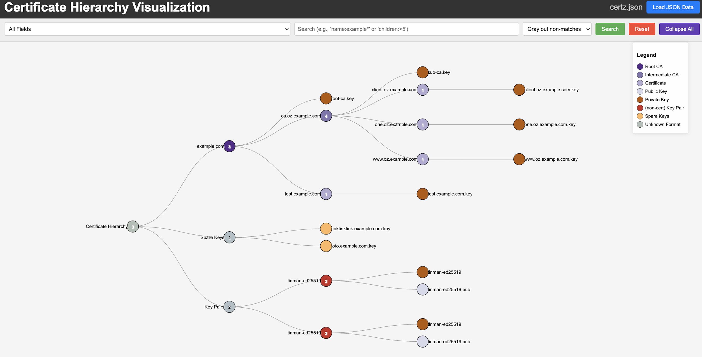

Certitude - Certificate/Key/etc. Hierarchy Visualizater
======

This comes in two parts... a python script to slice and dice cert/key/etc. files... and a HTML file that can be viewed
in a browser to actually see things.  I had a script I'd written some time ago... and decided to lean into Claude's AI
to finish it up...  hence the ridiculous size of the scripts :)

Here's a sample of what it shows, using the test data included -

To run you:

- gather up the certs/keys/X509 files of interest, perhaps toss them in a directory
- run certitude over them
- look at the results in the browser

Getting Started 
----

    # install python dependencies

    python3 -m pip install -r requirements

    #
    # These steps are already done, but feel free to run again, just giving an idea how this works
    #
    # to create some test certz
    ./make-test-certs.sh
    # create a JSON representation of the certs
    cd certz
    certitude.py * > ../certz.json
    cd ..

    # start a simple web server -
    ./https.py &

You can also use `jq` or other tools to look at the JSON directly, of course -

    #
    # show certs with matching public/private keys
    #
    jq -r '.["Key Pairs"].[]| "private: " + (.["Private Key"].filename|tostring) + "\t" + "public: " + (.["Public Key"].filename|tostring)' c.json
    private: certz/tinman-ed25519   public: certz/tinman-ed25519.pub
    private: certz/tinman-ed25519   public: certz/tinman-ed25519.pub

